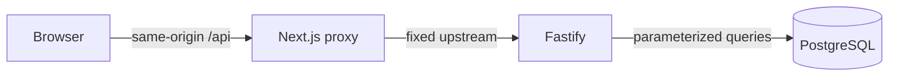

# Architecture and compatibility inventory

## Baseline audit

The source was a Vinext/Vite app running on a Cloudflare Worker with a D1 SQLite binding. It had 19 Next API route files, 35 tables after 11 historical D1 migrations, and a React dashboard with in-place views and public query-string share links. The previous CI used a manual Git clone/bootstrap and referenced root scripts that did not exist. At audit, TypeScript reported 12 errors and ESLint reported 182; the Node 24 SQLite regression harness also needed explicit handling of null-prototype rows. This migration preserves the JSX, CSS, and existing page/view URLs. The original D1 migration assets remain in `drizzle/`.

| API path | Methods | Responsibility |
| --- | --- | --- |
| `/api/auth/register`, `/login`, `/logout`, `/me` | POST, POST, POST, GET | account, opaque sessions |
| `/api/auth/verify-email`, `/resend-verification`, `/forgot-password`, `/reset-password`, `/set-password` | POST | hashed one-time tokens and credentials |
| `/api/auth/google`, `/google/callback` | GET | OAuth code, state, nonce, PKCE |
| `/api/auth/complete-profile`, `/providers` | POST, GET | profile completion and configured providers |
| `/api/characters`, `/evidence` | GET; evidence also POST | version catalog and reusable evidence |
| `/api/community` | GET, POST | battles, votes, comments, reactions, club progress/posts, squads, tournaments, reports, moderation, profiles, notifications, watchlists |
| `/api/squad-challenges`, `/squad-submissions`, `/squad-submissions/vote` | GET; latter two also POST | version-aware daily challenges, snapshots, ownership, votes |

Each original handler was moved to the Fastify route registry at the same path and method. The query-string action contracts and response bodies remain in place. The Fastify transport constructs a standard Request/Response boundary while the legacy modules are migrated to PostgreSQL queries; the SQL adapter translates the small SQLite syntax subset. This is an interim modularity limitation: the community and evidence handlers still aggregate several concerns. No second active rule implementation is served by Next.js.

## Trust boundary

The web app does not import repositories or database clients. The proxy uses only server-side `API_UPSTREAM_ORIGIN`, forwards cookies/status/headers, rejects unexpected redirects, and strips spoofable identity and forwarding headers. The API rejects disallowed `Origin`, ignores hosted identity headers, issues secure HTTP-only cookies in production, and uses database-backed hashed session tokens. A configured `APP_BASE_URL` is the sole browser origin. Direct API reads can be public, but writes enforce their existing authentication and ownership rules. No wildcard CORS is configured.

PostgreSQL schema is defined by Drizzle and its reviewed SQL in `packages/database/migrations/`. The D1 `votes.rowid` is represented as immutable `votes.argument_id`; existing reaction/comment/evidence references retain their numeric values. All 35 tables and their defaults, unique keys, and indexes were translated; `0001_squad_guards.sql` adds database-side squad vote/lifecycle protections.

## Current validation boundary

Fixture integration tests cover registration, verification, login, session revocation, battle creation/voting, daily squad submission, self-vote refusal, vote locking, and club spoiler visibility. Import tests check table counts, vote rowid references, ownership, snapshots, and password verification. OAuth against Google, Resend delivery, production D1 export, Vercel/Railway cookies, and staging cutover require their real accounts and credentials. See [migration](migration.md) and [deployment](deployment.md).
